# The Fantasy Land

**A Unity 3D adventure that combines exploration, combat, puzzles and persistent player progression in a dark fairy-tale world.**

**Group 7 · 2023 · Xinying Liu (Ashley Liu): gameplay systems, UI, persistence and character work.**

This repository presents the completed course project through authentic screenshots, gameplay clips and engineering documentation. It contains no application source code or redistributable Unity asset packages.

[Demo videos](#demo-videos) · [My contributions](#my-contributions) · [System design](docs/SYSTEM_DESIGN.md) · [Player guide](docs/PLAYER_GUIDE.md) · [Evidence and credits](docs/EVIDENCE.md)

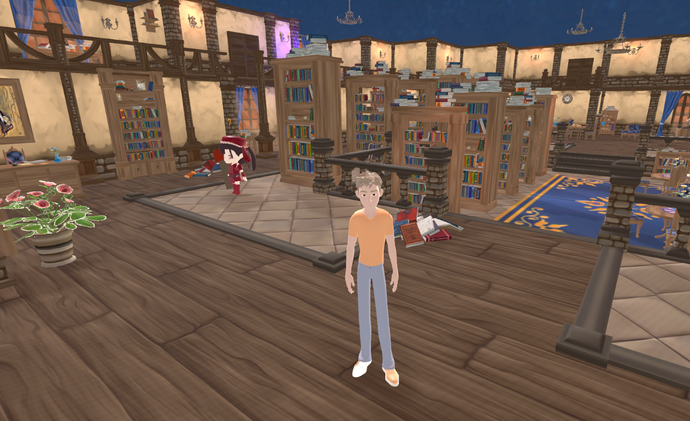

## Demo videos

Click a preview to open an original gameplay clip extracted from the final presentation.

| Movement and exploration | Combat |
|---|---|
| [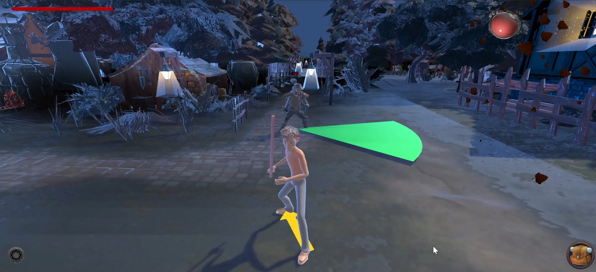](media/movement-demo.mp4) | [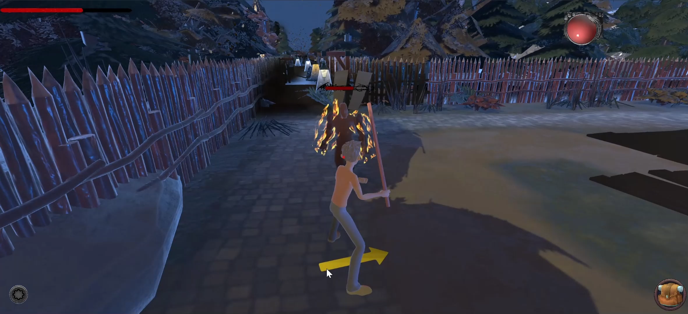](media/combat-demo.mp4) |
| [Watch demo video](media/movement-demo.mp4) | [Watch demo video](media/combat-demo.mp4) |

The clips are historical recordings of the team game, not a newly rebuilt version. The full narrated recording remains separate from this repository.

## Game experience

The protagonist moves from a library into a fairy-tale world where familiar characters conceal conflicting motives. Progress depends on collecting clues, interacting with NPCs, solving puzzles and surviving combat encounters.

| Environment | Player experience |
|---|---|
| Library | Explore the opening setting, collect clues and follow initial objectives |
| Forest / Pinocchio's cabin | Encounter guards, fight and uncover narrative information |
| Illusion maze | Navigate spatial puzzles and changing perspectives |
| Lost temple | Collect gems and interact with the Queen |
| Final arena | Resolve the story through a boss encounter |

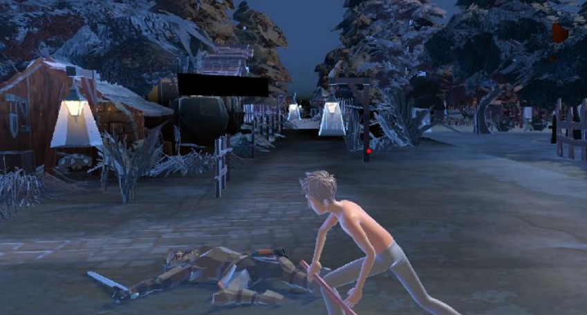

The manual and final presentation reflect revisions to chapter naming and ordering. The guide here follows the final gameplay material rather than implying that every early design detail shipped unchanged.

## My contributions

My individual report documents responsibility for the project's task, inventory, save/load and account-login systems, together with UI authoring and the main character model.

| Area | My documented work |
|---|---|
| Task progression | Release objectives when the preceding stage is completed; present the next goal through the task UI |
| Inventory | MVC organization, item/slot interaction, stacking, quantities, tooltips, drag-and-drop and item use |
| Persistence | JSON save/load/reset, player and NPC positions, scene/object state, item visibility and inventory UI restoration |
| UI | Voice, settings, help/rules, task, save and inventory panels with open/close and draggable interaction |
| Accounts | Username/password registration and login against MySQL; incorrect-input limits described in the report |
| Character creation | Main character modeling, rigging and UV texture work in Blender |
| Delivery | Technical research, risk assessment, player instructions, demo narration and team communication |

Face recognition login was a collaborative feature; I contributed ideas and did not independently implement the entire face-recognition subsystem. Character combat, dialogue, level construction and the overall game are presented as **team features**, not all as my individual work.

## Inventory: separating state from presentation

The report describes an **MVC inventory design**:

- **Model:** `KnapsackMgr` maintains the item data repository.
- **View:** inventory panels, slot contents, quantity labels and tooltip presentation.
- **Controller:** item/slot interactions translate collection, selection, dragging and use into state/UI updates.

The player can place collected items into a bag, stack repeated items, inspect hover information, rearrange slots and select an item for use. The presentation discusses finding available parent slots to avoid overlapping item UI.

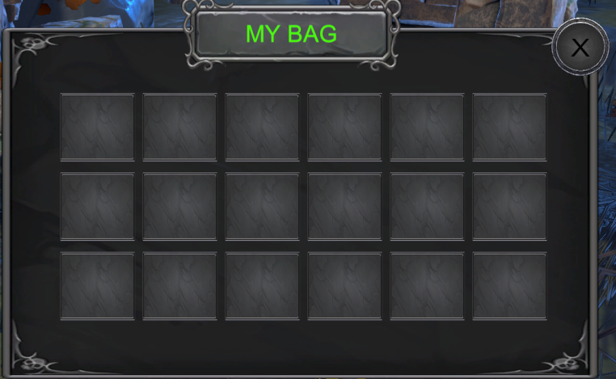

The technical distinction is between an item's identity, its quantity and its current visual location. Keeping these concerns separate matters when rebuilding inventory presentation after a load. The report explains this separation; this repository documents it without publishing the implementation.

## Persistence: reconstructing a playable scene

The documented save system captures a **scene-level state snapshot** as JSON: scene information, player/NPC locations, object identities and visibility, and inventory slot/UI information.

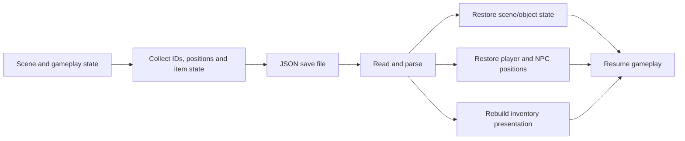

Manual save, load and reset are described alongside automatic per-scene saving through a singleton manager. Loading lets the player return to a saved state; it is not described here as continuous event replay or a versioned event-sourcing engine.

The key engineering challenge is restoring both **world state and interface state**: an already collected object must not reappear in the world while also remaining in the bag. [Detailed persistence discussion](docs/SYSTEM_DESIGN.md).

## Task progression and UI coordination

The task system gates the next objective on completion of the current stage. A task panel communicates the active objective and prevents later goals from being shown prematurely. The personal report groups task tracking into three chapter sections, while the final game documentation shows additional scene transitions.

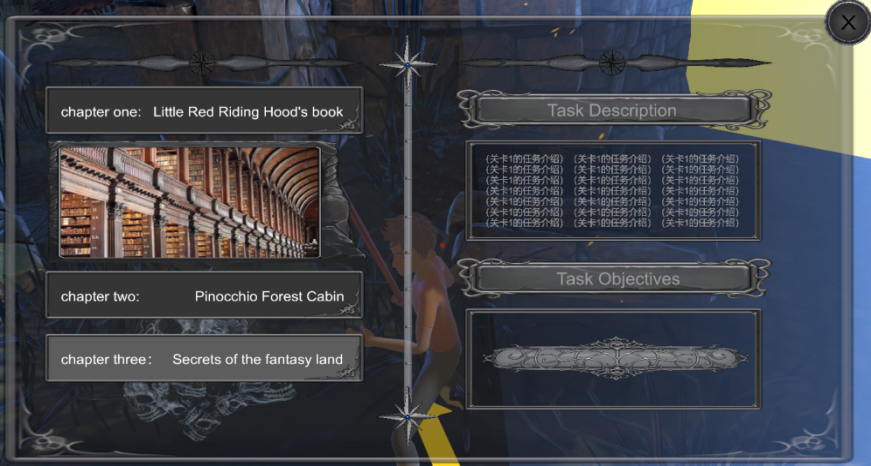

This creates a dependency between progression, scene transitions and persistence: a load must reconstruct a coherent objective rather than simply teleporting the player. The source materials describe these systems; no new automated integration test is claimed for the historical project.

## Team gameplay architecture

The final presentation describes an input abstraction and several cooperating character components:

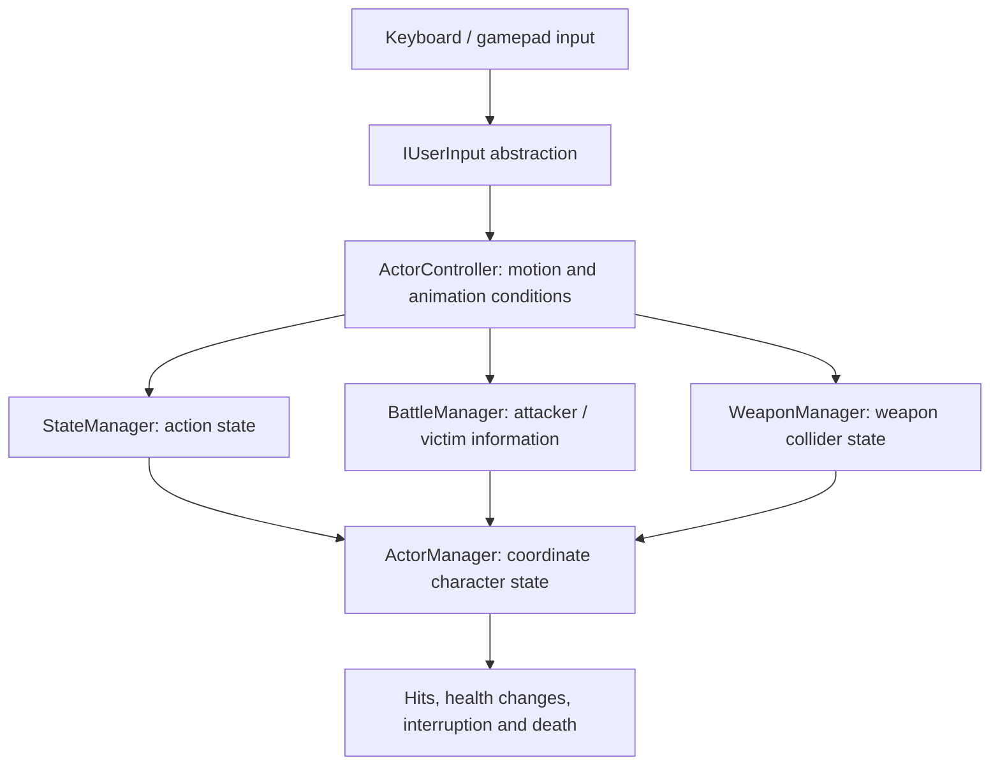

The presentation discusses action constraints such as preventing attacks while jumping, attack sequences and enabling/disabling weapon colliders according to action state. **Fungus** supports the dialogue flow. These are team-level design explanations derived from the final presentation.

## Art and interaction

| Main character | Alternate appearance |
|---|---|
| 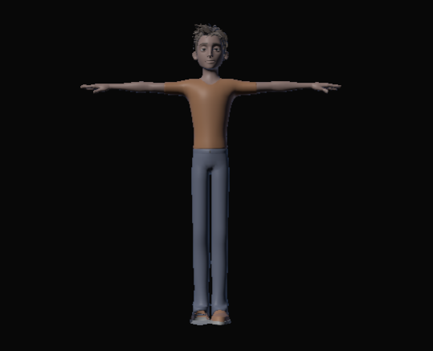 | 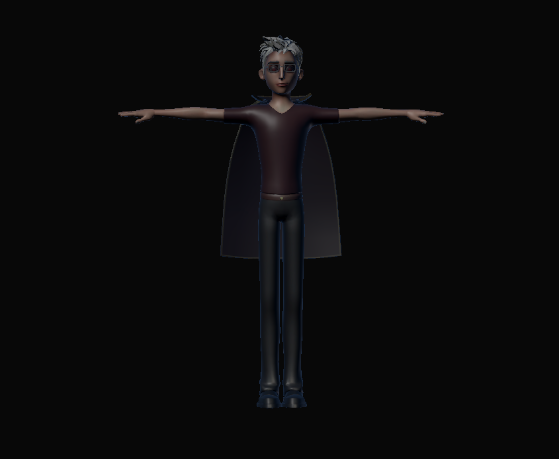 |

My character work includes modeling, skeletal rigging and UV texture work to support the protagonist's two appearances. The team also used scene art, particles, cinematic sequences and dialogue to establish the dark fairy-tale setting.

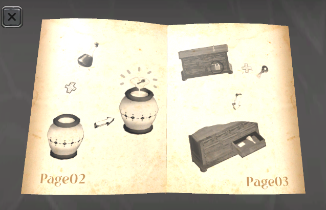

The diary gives players visual clues. The manual documents keyboard and gamepad interaction; [the player guide](docs/PLAYER_GUIDE.md) summarizes those controls.

## User feedback and engineering reflection

The final presentation includes questionnaire charts and live demonstration feedback. The satisfaction chart below is preserved from the original material:

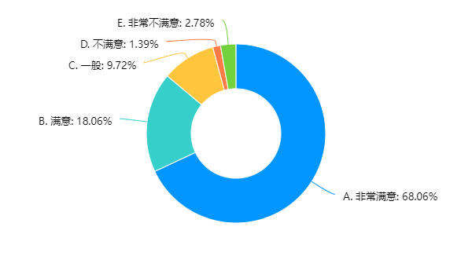

The sample size and raw response data are not included in the supplied materials. The figure is historical feedback evidence, not a new usability study or a validated quantitative performance result.

The early design report specifies targets such as a five-second start and at least 30 FPS. These are **requirements**, not measured results. The final deck discusses baked lighting, batching, texture compression and pooling, but does not provide controlled before/after profiling. This showcase therefore makes no measured FPS, memory or latency claim.

## Technology

| Purpose | Tools documented in project materials |
|---|---|
| Game development | Unity, C# |
| Character modeling / rigging / textures | Blender |
| Dialogue authoring | Fungus |
| Local progress persistence | JSON |
| Account data | MySQL; historical cloud database configuration |
| Collaboration | Git and Plastic SCM |

## Repository contents

- `assets/`: selected original project screenshots and a historical survey chart.
- `media/`: two original gameplay clips from the final presentation.
- `docs/`: system design, player guide, contribution/evidence notes and media provenance.

Application source, Unity projects, plugin binaries, raw asset packs, private account/database details and student identifiers are excluded.

## Team and rights

The project was created by **Group 7**: Chen Yijun, Wei Jinyue, Liu Xinying, Fu Yidi, Niu Zhuoqun and Cao Shihao. My individual contribution is described above and in the evidence notes.

Screenshots and videos document the team game. Third-party artwork, models, UI and plugins retain their original rights; this repository is not an asset redistribution license. [Credits and evidence](docs/EVIDENCE.md).

